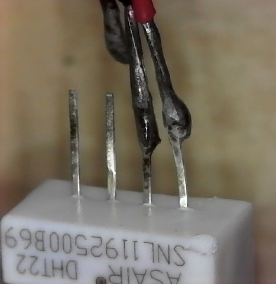
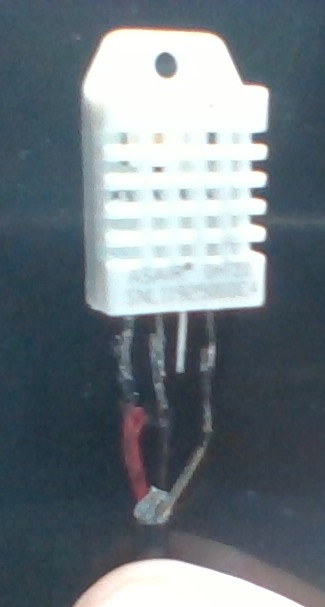
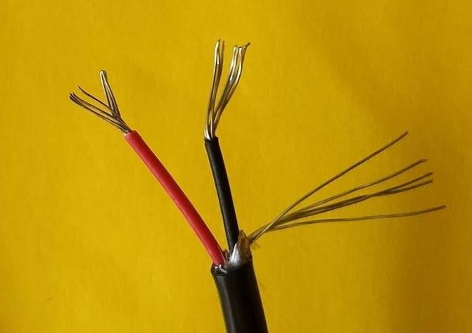
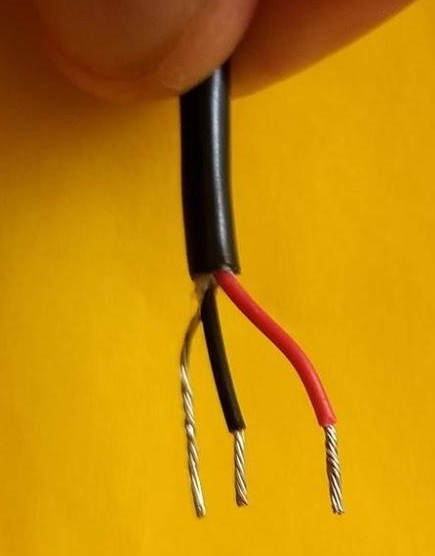
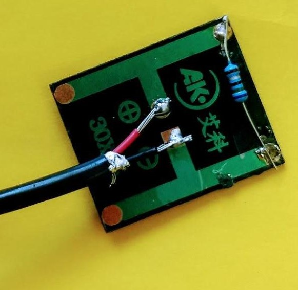
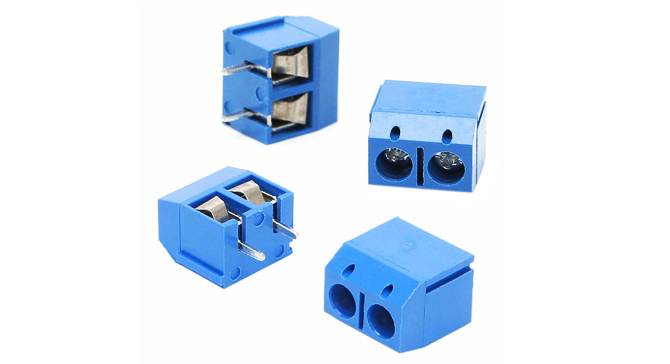
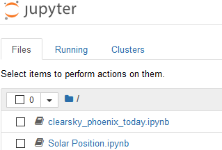

# Agrivoltaic Data Acquisition

## Overview

We need to collect data to determine the impact of the environmental conditions on plants' growth at different locations and the effect of a photovoltaic array. There are ways to get the data, including nearby weather stations and climate predictions for our location. We take measurements to determine the conditions at our location (sometimes called the micro-climate) with a data acquisition system.

Our system consists of an ESP32 microcontroller and a few sensors. The ESP32 is quite advanced since it contains Bluetooth, WiFi, and voltage measurement in addition to the primary microcontroller. To make the ESP32 interact with the sensors and the WiFi network, we need to write code to program it. The ESP32 has specific connections, called pins, to connect to the sensors, and we use specific code to talk to each sensor.

The sections below describe the programming and wiring needed to complete our device.

Steps are:

*   Installing the programming environment so we can test the ESP32
*   Assemble the components on the PCB
*   Attach the sensors.
*   Write the programs.


## Materials

_Table 1: Definitions of materials included in the research kit._

| Item | Appearance |
|--|--|
|  |  |

Additional items:

* Small screwdriver for the terminal blocks. [Home Depot has one for &lt; $2](https://www.homedepot.com/p/Stanley-4-Way-Pen-Screw-Driver-STHT60082/311369938).
*   Computer with administrator right for installing the Arduino software. 
*   Clips to hold the parts while soldering.
*   Side cutters to trim wires. Nail clippers also work great!
*   Hot glue to seal the connections. Nail polish is an alternative.
*   Multimeter

## Guides:

### Wire Stripping

The wirecutters in your kit have a bolt that slides up and down. Adjust the bolt for each wire size and tighten it. Get a feel for the correct pressure by practicing on old wires such as broken USB cables or telephone wire.

Wire stripping: [https://www.instructables.com/id/Use-scissors-to-strip-wires!/](https://www.instructables.com/id/Use-scissors-to-strip-wires!/) 

I find wire stripping with a knife easier than the strippers. Use a sharp craft knife. [https://www.instructables.com/id/How-to-Strip-Wire-Without-A-Wire-Stripper/](https://www.instructables.com/id/How-to-Strip-Wire-Without-A-Wire-Stripper/) 

### Soldering

There are many guides on the web and Youtube, so I will be brief here. A good start is: [https://learn.sparkfun.com/tutorials/how-to-solder-through-hole-soldering/all](https://learn.sparkfun.com/tutorials/how-to-solder-through-hole-soldering/all) 

Most connections are soldered as it is much more reliable than using a prototyping breadboard. Like most skills, soldering is challenging at first, but easy once you know how. 

*   Let the soldering iron heat up for 5 min before you start.
*   The iron must have liquid solder on it to transfer heat properly. It's really, really hard to solder if the solder won't stick to the iron.
*   'Tin' wires to add solder to them before you add to the piece. The PCB and ESP32 are already tinned.
*   You need one hand for the solder and one for the iron, secure everything and then solder.
*   Apply the iron to the joint for 1-2 seconds then apply the solder to the joint, not the iron. 
*   Let everything cool (solidify) before moving on.

## Programming Environment {#programming-environment}

We use the C/C++  language in the Arduino IDE to write code to tell the ESP32 how and when to take measurements and what to do with the data. The **C/C++** language produces fast code with a small size, so it uses less storage space and is ideal for microcontrollers. It is popular, so there is lots of code already out there. We can download a library to talk to the sensors without having to write it all ourselves. It is hard to learn, but you won't need to do much actual programming. Just compile and upload.

An **IDE** (integrated development environment) integrates several functions. It provides the editor where we write the actual code and format it, so it is easier to read. It manages libraries (pre-written code) to include with our code in the right way. The IDE compiles (translates) C/C++ into machine code instructions for the ESP32 and finally uploads (transfers) the machine code to the ESP32. There are many IDEs, but we use the **Arduino IDE** as it is free and simpler to install. The default language is C/C++

### Installing the Arduino IDE {#installing-the-arduino-ide}

The security settings are the greatest challenge to installing the Arduino IDE and especially the libraries. There are workarounds, but it is easier if you have administrator access.

These instructions are based on: [https://randomnerdtutorials.com/installing-the-esp32-board-in-arduino-ide-windows-instructions/](https://randomnerdtutorials.com/installing-the-esp32-board-in-arduino-ide-windows-instructions/)

*   Download the Arduino IDE from: [https://www.arduino.cc/en](https://www.arduino.cc/en/Main/Software)
*   [/Main/Software](https://www.arduino.cc/en/Main/Software)  Use the first link:


*   Run the downloaded file. Ctrl-j brings up recent downloads in most browsers.
*   Choose the default options and click **Next**
*   Choose **Install** on the **Windows Security** pop-ups.

 


*   Click **Close **when the install is complete.
*   Open Arduino application.
*   At the **Windows Security Alert**, check allow** Private and Private**, and then **Allow Access**.


*   You should see a window like below.


The Arduino IDE is now installed, and we now add the code libraries for talking to the ESP32.

*   Copy the following line to the clipboard by selecting it then ctrl-C

```
https://dl.espressif.com/dl/package_esp32_index.json

```

*   Click on **File** → **Preferences** and paste the line into **Additional Boards Manager URLs**. Click OK.


*   Click **Tools** → **Board **→  **Boards Manager**.


*   Type Esp32 in the top search box and select **Install**


*   Wait a couple of minutes, then select **Close**.
*   Click **Tools** → **Boards Manager** and select **Esp Dev Module**

#### Testing the Installation {#testing-the-installation}

The software installation is now complete. To test it we connect to the ESP32, either by itself or in the PCB. Remove the ESP32 from the packaging, including the white foam and place it on a piece of paper.  Do not let the ESP32 come in contact with metal as it will short out the pins. It is also static sensitive so don't handle it too much or put it on plastic.

*   Plug one end of the USB cable into the computer and the other end (microUSB like an Android phone) into the ESP32. Plug in either end first.
*   A red light should come on in the ESP32.
*   In the Arduino IDE select the Com port E.g. **Tools **→ **port **→ **COM5**. Your system will likely have a different number. It will also change if you change USB port so use the same USB port each time.
*   On a Mac or Linux the serial port starts with /dev
*   The **Tools** menu should look something like this:


If the ESP board is not showing up, try to install the driver from the following location:

[https://www.silabs.com/products/development-tools/software/usb-to-uart-bridge-vcp-drivers](https://www.silabs.com/products/development-tools/software/usb-to-uart-bridge-vcp-drivers)      

#### Our first program: A Blinking Light.

To test the communications link, we write and upload a simple program that makes a light blink.

*   The main editor window should still look like this:


*   Delete the existing contents in the editor.
*   Copy the code below and paste it into the editor.

    ```
    const int ledPin = 2;

    // the setup function runs once when you press reset or power the board
    void setup() {
      // initialize digital pin ledPin as an output.
      pinMode(ledPin, OUTPUT);
    }

    // the loop function runs over and over again forever
    void loop() {
      digitalWrite(ledPin, HIGH);   // turn the LED on (HIGH is the voltage level)
      delay(1000);                  // wait for a second
      digitalWrite(ledPin, LOW);    // turn the LED off by making the voltage LOW
      delay(1000);                  // wait for a second
    }
    ```

*   Click **File **→ **Save **and give it the filename of ESPblink
*   Select the tick . The compiler will check the code for errors and convert the C code to machine code. Completion results in the message "Done Uploading" and the black message area should look like below.


The next step is a bit tricky.

*   Click on the 


 to upload the code to the ESP32. It will say compiling for a few seconds.
*   When the message 


 appears, hold down the BOOT button on the ESP32 for a few seconds until a lot of text appears.
*   When it is finished uploading the message 


appears and there is a blue flashing light on the ESP32.

    


#### 
    Further Programming {#further-programming}

Try changing the blink code. For instance, change the line delay(1000) to delay(200). The first instance of delay determines the on-time and the second instance determines the off-time.

    The setup of the Arduino IDE is now complete. The programming section below includes code to interact with the sensors, but first we need to assemble the hardware.

## Assembling the Board {#assembling-the-board}

To have the sensors talk to the microcontroller, we need to connect specific pins to specific wires on the sensors. In the schematic below, the heavy color lines are the wires. There are wires inside the board (called tracks) that are shown in the schematic but are not visible in the actual board. The wires under the ESP32 are bad practice but was the only way to get everything to fit.

At the moment, the ESP32 is powered by the USB connection. A regulator inside the ESP32 converts the 5 V from the USB to 3.3 V used by the ESP32 circuits and is also available to the external circuits via the pin marked 3V3.


[Figure 1](#figur_wiring)_: Board wiring diagram. The components and wires go on the top of the board and all the soldering is done from the bottom. There are more details on the microprocessor and internal board wiring below._


[Figure 2](#figur_boardrear)_; View of the board from the bottom. There should be solder joints at the black dots._

For the assembly of the board, start with the wires, then do the terminal blocks, and finally the microcontroller. The two sides of the board are similar, so make sure you use the convention in the figures above. The top is as pictured in [figure 1](#fig_wiring) above. The numbers are the right way up, the "CS" is at the top and the "CircuitSetup.us…" label is on the right-hand side. The wires and components all go on the top of the board and connections soldered from the bottom.

### Components {#components}

#### Wires {#wires}

Cut lengths of wire slightly longer than shown above. Remove 3 - 5 mm of insulation from each end of the wire. Bend the ends of the wires over and poke through the correct holes in the PCB.


[Figure 3](#figur_bentwire)_: Wire ready to insert in the PCB._

Solder the ends of the wires to the holes in the PCB from the bottom of the board. Trim off any excess with wire cutters or nail clippers.

&lt;insert picture of soldering>


#### Resistor For DHT22 {#resistor-for-dht22}

There is a 10k resistor with the DHT22. Bend the legs of the resistor over and insert it at the location indicated in [figure 1](#fig_wiring). Solder from the bottom the same way as with a wire. Then snip off the excess leads.


[Figure 4](#figur_10kresistor)_: The colors show it is a 10k resistor. Snip off the excess leads after soldering into the board._

#### Terminal Blocks. {#terminal-blocks}

The terminal blocks go in the locations indicated. Looking from the bottom, each pin of the terminal block should be on the same horizontal line of holes as a wire termination.


(red wire at the top is incorrect!)

[Figure 5](#figur_boardblocks)_: Terminal blocks on the board. Don't worry about the red wire on the right. It is just a soldering practice wire._

#### Testing the electrical connections

#### ESP32 board. {#esp32-board}

The ESP32 board is the hardest to solder, so we do it at the end. For now, just solder the 5 pins shown in Table 2 below.

_Table 2: Pins in use on the ESP32_

| Location    | Pin    | Usage                                                                       |
|--------------|---------|------------------------------------------------------------------------------|
| b1          | 3V3    | 3\.3 volt positive supply for the sensors                                   |
| b2          | GND    | Ground or negative supply to the sensors\.                                  |
| b15         | D23    | Digital communication with the DHT22                                        |
| j11         | D34    | Analog voltage input from the solid moisture sensor\. Also called ADC6\.    |
| j12         | D35    | Analog input from the solar cell\. Also called ADC 7\.                      |


[Figure 6](#figur_finishedboard)_: Finished board front and &lt;insert picture of back>_

### Testing the board {#testing-the-board}

Check over the board once again and make sure all everything is in the right location, and there are no solder bridges. Use a microscope or magnifying glass if available.

Briefly plug-in the ESP32 to USB power. The red light should come on. If it looks dim, then unplug the board immediately.

## Wiring up the sensors {#wiring-up-the-sensors}

The sensors are at the end of long cables so we can position them in the field. There is ~10ft of cable, and we need three cables for the sensors. Cut the 10 ft cable in half, so you have two 5 ft cables. Then cut ONE of the cables in half to give two 2.5 ft cables. This will result in:

*   The 5 ft length for the soil monitor.
*   2.5 ft cable for the solar sensor
*   2.5 ft cable for the DHT22

### DHT22 sensor and cable {#dht22-sensor-and-cable}

Strip off about 1.5 cm of outer covering from one end of a 2.5 ft length of cable. Tear off the foil covering or cut it with scissors. Strip ~ 5 mm of the red and black wire. Tin the ends of the wire with solder.


[Figure 7](#figur_cablestrip)_: Strip in the end of the cable and soldering (tinning) the ends._

Clamp the wires and the DHT22 so they don't move. It is easier to line up one wire at a time, solder it, and then move on to the next wire. Fold back pin 3 so it is out of the way. Spread out the remaining pins so that they don't touch each other.





[Figure 8](#figur_dht22solder)_: Soldering to the DHT22 with wire order: red, black, skip, silver._

The other end of the cable goes into the terminal block. As before, strip off 1.5 mm of covering and remove the foil. Strip off 5 mm (about ⅓ of the exposed) of the red wire and about 7 mm (about a half) of the black wire. Twist the strands of each wire together as tightly as possible.  Fashion a 'pitchfork' as in the figure below where the black wire is in the center. Trim a few mm of the end of the black wire so they are all about the same length.






[Figure 9](#figur_terminal)_: Flare the ends of the wire so they are easier to twist. Line up the ends of the pitchfork by trimming the end of the black wire slightly. Make sure there are no stray wire strands coming out of the block._

Unscrew the screws in the terminal block. Referring to [figure 1](#fig_wiring), insert the three wires into the terminal block. It is slightly easier to insert the middle black wire first and then the other two wires. Slightly tug on the wires to make sure they are secure. Getting all the wires in the terminal block is challenging.

### Soil Monitor {#soil-monitor}

Use the longer 5 ft cable. Similarly to the previous sensor, strip off 1.5 cm of outer cable and 5 mm from the ends of the red and black. Insert the wires into the soil monitor and solder. Connect Red to VCC, black to SGN, and the silver wire to GND.


[Figure 10](#figur_soil)_: Right: Insert wires into the soil monitor in the order shown and solder. _

_Left: Follow the instructions for the DHT22 to connect the other end of the cable to the terminal block.  The picture shows the PCB inserted in the case. _

### Solar Sensor Cell {#solar-sensor-cell}

The solar sensor only uses two wires. Strip the wires as above but cut off the silver wire at both ends completely. Attach one end to the solar cell as in the figure below. 



[Figure 11](#figur_cell)_: Soldering the wires to the solar cell. The red wire goes to the plus ⊕ terminal and black to the 'negative' ⊖._

Insert the red and black wires into the terminal block as in [figure 1](#fig_wiring). Cut off the silver wire. 

### Finishing up {#finishing-up}

Test the system in the software section below. It is easier to debug when the board is out of the box.

The PCB goes in the case so the USB port lines up with the square-ish hole. The cables to the sensors go in the notches at the other end. The top just snaps on and should squash down on the cables so they don't pull out of the terminals. If the lid won't go all the way down either cut out the notches or wrap electrical tape around the whole box.

## Technical Details of the System {#technical-details-of-the-system}

add details about the sensors etc. It confusing if it is mixed up with the assembly.


_Left: A clearer picture of the in the board. Zoom in to see the wires_._ Right: Our configuration of the ESP32 with the pins labeled._

#### Aside: Microcontroller vs Microcomputer {#aside-microcontroller-vs-microcomputer}

A **microcontroller **does a small number of specific tasks reliably. They do not multitask, so changing the application requires reprogramming. They are 'real-time' and commands happen on-time and without delay. The ESP32, Arduino, and the controller in your microwave oven are all examples of microcontrollers.

A **microcomputer **can run lots of different tasks (multitask) simultaneously and the user can easily switch from one task to another. They do not operate in 'real-time,' so a task may be delayed a couple of seconds. These delays are annoying for a computer user but would be catastrophic when controlling a nuclear power plant. A Raspberry Pi, iPhone, Windows PC are all examples of microcomputers.

Microcontrollers and microcomputers often work together.

#### Aside: Programming Languages. {#aside-programming-languages}

There are so many programming languages because computers are used in so many different ways. Some programming languages are suited to making user interfaces while others are better for programming microcontrollers. There are many tradeoffs between the languages: how fast the program runs, speed of programming, security, portability (does it run on different types of computers).

## Programming {#programming}

The google drive has programs to test each sensor in the folder: **Agrivoltaic Research Program Materials/Program Code/Arduino**. The code needs to be downloaded, compiled, and uploaded to the ESP32. 

### Transfer from Google Drive to Arduino IDE {#transfer-from-google-drive-to-arduino-ide}

There are multiple ways to transfer code from the Google Drive to the Arduino IDE. Here is one way:

*   Right-click on the folder Arduino and select **Download**.
*   Unzip the Arduino folder.
*   Move the folder **ESP_Soil_monitor** to your Arduino folder. Typically, this is **Documents/Arduino**

### Upload to ESP32 {#upload-to-esp32}

*   Load the code into Arduino IDE
*   Click 


 to verify/compile the code. Since **upload **complies and uploads this step can be skipped. 
*   Click on the 


 to upload the code to the ESP32. It will say compiling for a few seconds.
*   When the message 


 appears, hold down the BOOT button on the ESP32 for a few seconds until a lot of text appears.
*   When it is finished uploading the message 


appears and the program will run on the ESP32.
*   What happens next depends on the code and there is a description in the text below.
*   Sometimes you may have to press EN (enable) on the ESP32 to restart the program and see messages at startup.

### ESP_Blink {#esp_blink}

The ESP_Blink code is the same code that Arduino IDE used as an example and will just flash the blue LED. Use Esp_blink to make sure that you can still upload code, and especially if you have problems with more advanced code.

### ESP_Soil_Monitor {#esp_soil_monitor}

Upload the code to the ESP32. Upon pressing **BOOT**, the blue LED should flash rapidly for a few seconds. It will then flash once a second as it does each measurement.

Open the serial monitor with **Ctrl-Shift-M** or **Tools **→  **Serial monitor**.

Change to **115200 baud** in the Serial Monitor.


 The screen should show:

```
Soil Moisture = 0
```

Hold the two probes in your hands and the numbers should increase to 3000 or so.

### ESP_Light {#esp_light}

After uploading to the ESP32, the blue light should blink for a few seconds. The Serial Monitor should show something like:

```
    Light = 40
```

Shine a very bright light on the solar sensor and the numbers should increase.

### ESP_Sensors {#esp_sensors}

The DHT22 needs two extra libraries installed:

In the Arduino IDE go to **Tools **→ **Manage libraries**.

Install the following two libraries. They can take a while to find as there is a large list to scroll down, even with the search string.


After uploading the code to the ESP32 the blue light should flash quickly for a few seconds and then flash about once per second as a measurement is taken.

The Serial Monitor should repeatedly display:

    **Humidity: 40.20%  Temperature: 26.80°C 80.24°F  Heat index: 26.73°C 80.11°F**

    **Soil Moisture = 0**

    **Light = 53**

### ESP_WiFi_Sensors {#esp_wifi_sensors}

This code starts a small web server that measures and displays the sensor readings every time the page is viewed. It needs a connection to a Wifi network to function.

Load the code into the Arduino IDE and look for the section:

```
    const char* ssid = "YOUR_WIFI_SSID"; 
    const char* password = "YOUR_WIFI_PASSWORD";
```

Change to match your WiFi network and keep the quotes. E.g.:

```
    const char* ssid = "netgear"; 
    const char* password = "password1";
```

After uploading the code to the ESP32, the blue LED flashes rapidly and then stops.  Open the Serial Monitor. If the screen is empty press the EN button to restart the ESP32. You should see something like:

```
    rst:0x1 (POWERON_RESET),boot:0x13 (SPI_FAST_FLASH_BOOT)
    configsip: 0, SPIWP:0xee
    clk_drv:0x00,q_drv:0x00,d_drv:0x00,cs0_drv:0x00,hd_drv:0x00,wp_drv:0x00
    mode:DIO, clock div:1
    load:0x3fff0018,len:4
    load:0x3fff001c,len:1216
    ho 0 tail 12 room 4
    load:0x40078000,len:9720
    ho 0 tail 12 room 4
    load:0x40080400,len:6352
    entry 0x400806b8
    ESP_WIFI
    Connecting to EAT
    ..
    WiFi connected.
    IP address:
    192.168.1.18
```

Ignore the first lines as they are just ESP32 diagnostics that show each time it starts up. Copy the last line that consists of four numbers separated by periods, paste it into your browser, and press return. You should see something like:



For each page refresh (Ctrl-r) the ESP32 will take a new reading and display it on the website. The blue light also blinks.

An alternative way to find the IP number of the ESP32 is to login to your

That completes the basic setup of the data acquisition system.

## Web Display

There are many ways to log to the web. For now, we'll use "dweets" as they are the simplest. 

Download **ESP_Dweet** to to Arduino IDE

As above, Change to match your WiFi network and keep the quotes. E.g.:

```
    const char* ssid = "netgear"; 
    const char* password = "password1";
```

Change the code word on line:

	**<code>String code_word = "ASU";</code></strong>

Use exactly the same capitalization as in the table above.

Also, change your light sensor calibration if you know it. Otherwise leave it as 1.0

```
const float lightCalibration = 1.0;
```

Upload to the ESP32 and open the serial monitor and check it it running. Eg:

**GET /dweet/for/agripvASU?temperature=26.8&humidity=37.8&sun=0.00&moisture=0.00 HTTP/1.1**

Check to see if the dweets are going to the web. Relace the ASU with your code word.

**https://dweet.io/follow/agripvASU**

Eventually it should display:


And it should also display on the link:

[https://freeboard.io/board/iodACa](https://freeboard.io/board/iodACa)

## Finishing Off 

### Solar Cell calibration

As well as a power converter, solar cells can measure sunlight intensity. **Insolation **is the technical term for the solar irradiance and is measured in W/m². We also use suns as a convenience unit where:

	1 sun = 1 kW/m².

The **short circuit current**, I<sub>SC</sub> of a solar cell is linear with light intensity, so that double the light intensity results in a doubling of Isc. 

The ESP32 measures voltage not current. However, soldering a resistor across the output terminals of the solar cell converts the current into a voltage. 


[Figure 12](#figur_sensor_cell)_: IV curves of a solar cell under varying light intensity. A 10 ohm resistor converts the current to a voltage for the ESP32._

The figure above shows a 1 cm² solar cell under varying light intensity. The Isc is 0.038A (38 mA) at one sun and the voltage across the resistor is 0.38 V. At 0.4 suns, Isc is 0.4*0.38 = 0.0152A and the voltage is 0.152 V.

Most solar cells work as sensors but need calibration with a light source of known light intensity that has similar brightness and spectrum (color) as the sun. Well calibrated light sources are expensive and it is easier to use the sun. Insolation is quite predictable on a clear sunny day.

##### How bright is the sun?

The light intensity for 2020-06-24 is on the Google Drive as **2020-06-24.xlsx**. The first column is the time and the second column is the light intensity on a horizontal surface in suns.

There is also an online calculator at the link:

[https://mybinder.org/v2/gh/trautsned/pv_online/master](https://mybinder.org/v2/gh/trautsned/pv_online/master)

After a minute or so you should see:



Select the link **clearsky_phoenix_today.ipynb**

Select menu item** Cells → Run All**

The rest of the instructions are in the notebook itself. 

##### Calibration

Run the tester so that it is showing Light reading either directly on the screen via the serial monitor or via WiFi

Put the cell outside between 10 am and 2 pm. It should be as horizontal as possible and away from white wall. Morning is better as it is cooler.

Record the **Light:** reading on tester in counts.

Divide the counts by suns.

For example

Date and time: 2020-06-21 at 14:15

Sunlight intensity: 0.864 suns

Light counts: 428. 

Calibration factor: 428/0.864 =** 495 counts/sun**

So divide future readings by 495 to convert to suns. Enter the value into LightCalibration on the **ESP_dweet** code.

#### Seal the sensors

Once you have everything tested and running we need to seal it from the environment. The easiest is with hot glue and electrical tape. It's not ideal for outdoor use, but it should last a while. Use higher-quality electrical tape rated for outdoor use if available. Nail polish also works as an alternative to hot glue.


[Figure 13](#figur_sealh)_ Spread out the connectors on the humidity sensor so they are not touching. Bend the extra pin out of the way and then cover the connectors with hot glue. Finally, wrap the connectors with electrical tape. Start wrapping the electrical tape from the cable, go up to the connectors and back down again._


[Figure 14](#figur_sealsoil)_: For the soil moisture sensor, cover the exposed electrical connectors on the red part with hot glue. Then wrap everything in electrical tape._


[Figure 15](#figur_sealcell)_: Similarly for the solar cell, cover the exposed parts with hot glue and layers of electrical tape. Just put layers across the back of the cell so there is no coverage on the active front._

#### Assemble the case.

Snap the lid on. The lid is designed to squash down on the wires to secure them, but I just eyeballed the slots. Wrap a couple of layers of electrical tape around the lid to secure it.

#### Situating the box

Keep the box in the shade and away from moisture. The sensor needs to connect to WiFi.

The soil sensor can get wet but keep the humidity and light sensor away from moisture.

## Troubleshooting {#troubleshooting}

Is the red power light on? If it is, it means that there is power to the device and there is not a short from the 3V3 pin to ground. If the red-light is off, then either the USB power is not giving power or there is a short to ground. 

Reopen the ESP_Blink file and upload it to the ESP32.  Do you get a blinking light? Did you remember to press the boot button?

Unplug the ESP32 board from the USB cable and connect to a different port on your computer. Close down the serial monitor and the Arduino IDE. Plugin the ESP again and open the Arduino IDE. Follow the instructions again for the section above **Our first program: A Blinking Light**.

Remove all the sensors from the terminal blocks, and upload ESP_Sensors.

The blue light should flicker for a couple of seconds and then show the following:

```
    Agrivoltaics
    Failed to read from DHT sensor!
    Humidity: nan%  Temperature: nan°C nan°F  Heat index: nan°C nan°F
    Soil Moisture = 0
    Light = 39
```

The light number will be random.

If you see the message over and over again it means the ESP32 is continuously restarting, also known as a boot loop.

```
    rst:0x1 (POWERON_RESET),boot:0x13 (SPI_FAST_FLASH_BOOT)
    configsip: 0, SPIWP:0xee
    clk_drv:0x00,q_drv:0x00,d_drv:0x00,cs0_drv:0x00,hd_drv:0x00,wp_drv:0x00
    mode:DIO, clock div:1
    load:0x3fff0018,len:4
    load:0x3fff001c,len:1216
    ho 0 tail 12 room 4
    load:0x40078000,len:9720
    ho 0 tail 12 room 4
    load:0x40080400,len:6352
    entry 0x400806b8
```

It will do it when uploading a program but should not do it at other times.

Remove the red wire in the top left-hand corner of [figure 1](#fig_wiring).  You can either cut it or desolder. Cutting the wire cuts the power to the sensors. If there is a problem with board wiring, it will be isolated from the ESP32. Try the blink program again.

#### Testing the Soil Moisture Sensor with a Voltmeter {#testing-the-soil-moisture-sensor-with-a-voltmeter}

It is easier to test the soil sensor when connected to the terminal blocks. The voltage between the silver wire and the red wire should be 3.3 volts. The black SIG wire to the silver wire should be close to zero when disconnected and 1-2 volts when there is a conductor between the probes such as a wet hand.

#### Testing the Solar Cell Sensor with a Voltmeter {#testing-the-solar-cell-sensor-with-a-voltmeter}

The sensor produces a voltage in proportion to the light intensity. It is easier to test when disconnected from the terminal blocks. It is designed for sunlight so it needs a very bright light. Put the voltmeter in the mV (200m) setting and bright light should make the voltage increase. 

